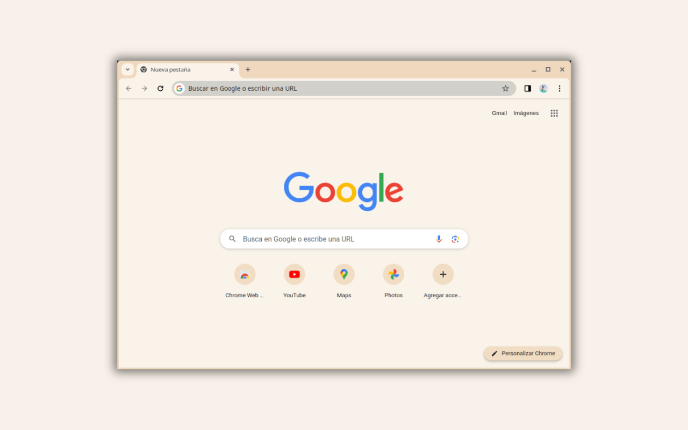

# Minimalist Horchata

A minimal Chrome theme in a warm, creamy palette, by Miguel Euraque.

A warm cream frame, an off-white toolbar and new tab page, and a soft warm-gray text. The palette mirrors the milky beige of horchata, calm and easy to live with.

## Features

- **Palette:** warm cream frame, off-white surfaces, soft warm-gray text
- **Minimalist design:** clean and uncluttered
- **Easy installation:** Chrome Manifest V3
- **Gentle on the eyes:** low-contrast colors that stay easy to read

## Installation

### Chrome Web Store (recommended)

1. Visit the [Minimalist Horchata](https://chromewebstore.google.com/detail/minimalist-horchata/lbfnkjoiiobpcnmfpaflefnldpioooka) page in the Chrome Web Store.
2. Click **Add to Chrome**.

### From source

1. Clone this repository.
2. Open `chrome://extensions` and turn on Developer mode.
3. Click **Load unpacked** and select the theme folder.
